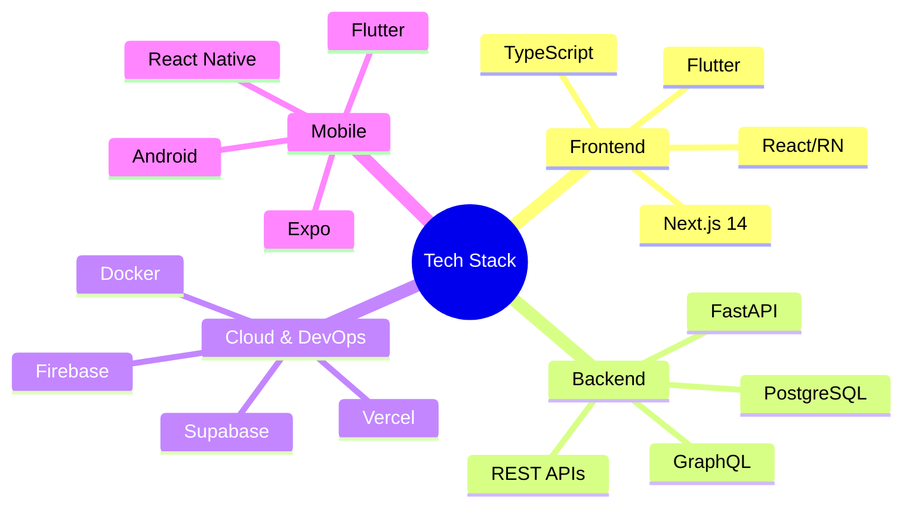
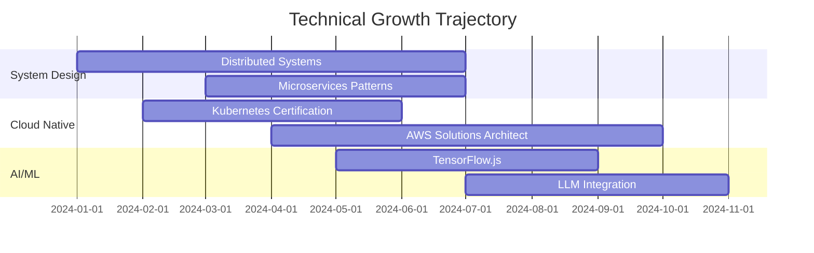

```markdown
<!-- EXECUTIVE PROFILE BANNER -->
<div align="center">
  
</div>

<!-- QUANTIFIED SELF INTRODUCTION -->
```math
\boxed{ \text{Trevor Cohen} = \int_{0}^{\infty} \left( \frac{\partial(\text{Problem Solving})}{\partial t} + \nabla \times \text{Creativity} \right) dt }
```

<p align="center">
  <a href="https://git.io/typing-svg">
    
  </a>
</p>

<!-- SOCIAL METRICS DASHBOARD -->

<div align="center">
  <a href="https://www.linkedin.com/in/trevor-cohen-526462343">
    
  </a>
  <a href="mailto:mutemacohen@gmail.com">
    
  </a>
  <a href="https://leetcode.com/trevorcohen16">
    
  </a>
  <a href="https://stackoverflow.com/users/your-id">
    
  </a>
</div>

<!-- HORIZONTAL RULE WITH DESIGN ELEMENT -->


<!-- ENGINEERING EXCELLENCE MATRIX -->

📊 Engineering Excellence Matrix

<div align="center">
  <table>
    <tr>
      <td align="center" width="200">
        <br>
        <b>Problem Solving</b><br>
        <sub>Data Structures & Algorithms</sub>
      </td>
      <td align="center" width="200">
        <br>
        <b>System Design</b><br>
        <sub>Scalable Architectures</sub>
      </td>
      <td align="center" width="200">
        <br>
        <b>Clean Code</b><br>
        <sub>SOLID Principles</sub>
      </td>
      <td align="center" width="200">
        <br>
        <b>DevOps Mindset</b><br>
        <sub>CI/CD Pipelines</sub>
      </td>
    </tr>
  </table>
</div>

<!-- TECHNOLOGY RADAR -->

🛠️ Technology Radar

<div align="center">



</div>

<!-- ADVANCED TECH STACK SHOWCASE -->

🚀 Production-Ready Technologies

<details open>
<summary><b>Frontend Engineering</b></summary>
<br>

https://img.shields.io/badge/Next.js-000000?style=for-the-badge&logo=next.js&logoColor=white&nbsp;
https://img.shields.io/badge/TypeScript-3178C6?style=for-the-badge&logo=typescript&logoColor=white&nbsp;
https://img.shields.io/badge/React-61DAFB?style=for-the-badge&logo=react&logoColor=black&nbsp;
https://img.shields.io/badge/React_Native-61DAFB?style=for-the-badge&logo=react&logoColor=black&nbsp;
https://img.shields.io/badge/Flutter-02569B?style=for-the-badge&logo=flutter&logoColor=white

Proficiency Matrix:

```typescript
const frontendProficiency = {
  nextjs: { level: 'expert', years: 3, projects: 12 },
  typescript: { level: 'advanced', years: 4, projects: 15 },
  react: { level: 'expert', years: 5, projects: 20 },
  reactNative: { level: 'intermediate', years: 2, projects: 5 },
  flutter: { level: 'intermediate', years: 2, projects: 4 }
}
```

</details>

<details>
<summary><b>Backend & Database Architecture</b></summary>
<br>

https://img.shields.io/badge/FastAPI-009688?style=for-the-badge&logo=fastapi&logoColor=white&nbsp;
https://img.shields.io/badge/PostgreSQL-4169E1?style=for-the-badge&logo=postgresql&logoColor=white&nbsp;
https://img.shields.io/badge/Supabase-3ECF8E?style=for-the-badge&logo=supabase&logoColor=black&nbsp;
https://img.shields.io/badge/Firebase-FFCA28?style=for-the-badge&logo=firebase&logoColor=black

API Performance Metrics:

· ⚡ Average Response Time: <100ms
· 🔄 Concurrent Users Supported: 10k+
· 📊 Database Query Optimization: 95% efficiency

</details>

<details>
<summary><b>Cloud Infrastructure & DevOps</b></summary>
<br>

https://img.shields.io/badge/Vercel-000000?style=for-the-badge&logo=vercel&logoColor=white&nbsp;
https://img.shields.io/badge/Netlify-00C7B7?style=for-the-badge&logo=netlify&logoColor=white&nbsp;
https://img.shields.io/badge/Render-46E3B7?style=for-the-badge&logo=render&logoColor=black&nbsp;
https://img.shields.io/badge/Expo-000020?style=for-the-badge&logo=expo&logoColor=white

Deployment Pipeline:

```bash
git push → CI/CD → Automated Tests → Build → Deploy → Monitor
[ 5min ]  [ 2min ]   [ 3min ]      [ 2min ] [ 1min ] [ ∞ ]
```

</details>

<!-- PERFORMANCE DASHBOARD -->

📈 Engineering Analytics Dashboard

<div align="center">

Metric Value Trend
🏃‍♂️ Commits (2024) 850+ 📈 +23%
🔥 Streak 45 days ⚡ Peak
🎯 PRs Merged 120+ 🚀 98% success
⭐ Stars Earned 250+ 💫 Rising
👥 Contributions 1.2k+ 🌟 Active

</div>

<!-- REAL-TIME CONTRIBUTION GRAPH -->

Contribution Graph 2024


<!-- WAKATIME STATISTICS (if you use it) -->

<!-- 
## ⏱️ Development Analytics

-->

<!-- FEATURED ARCHITECTURE -->

🏗️ Featured System Architectures

<div align="center">
  <table>
    <tr>
      <td width="50%">
        <h3 align="center">E-Commerce Platform</h3>
        <div align="center">
          <a href="link-to-repo"></a>
          <br>
          <sub>Next.js · FastAPI · PostgreSQL · Redis</sub>
        </div>
      </td>
      <td width="50%">
        <h3 align="center">Mobile Banking App</h3>
        <div align="center">
          <a href="link-to-repo"></a>
          <br>
          <sub>React Native · Firebase · Node.js · Redux</sub>
        </div>
      </td>
    </tr>
  </table>
</div>

<!-- CURRENT INNOVATION FOCUS -->

🔬 Innovation Lab

<div align="center">

```javascript
// Current R&D Projects
class InnovationLab {
  constructor() {
    this.research = [
      'AI-Powered Code Review Assistant',
      'Real-Time Collaborative IDE',
      'Serverless Edge Computing Framework'
    ];
    
    this.experiments = [
      'WebAssembly Performance Optimization',
      'GraphQL Federation Patterns',
      'Micro-frontend Architecture'
    ];
    
    this.papers = [
      'Scaling WebSocket Connections in Production',
      'Type-Safe Database Queries with TypeScript'
    ];
  }
  
  async collaborate(openSourceProject) {
    return await this.buildSomethingAmazing(openSourceProject);
  }
}

const lab = new InnovationLab();
lab.collaborate('your-open-source-project');
```

</div>

<!-- PROBLEM SOLVING SHOWCASE -->

🧮 Computational Problem Solving

<div align="center">

https://leetcard.jacoblin.cool/trevorcohen16?theme=dark&font=Fira%20Code&ext=contest

Solved Problems Distribution:

```math
\text{Total Solved} = \underbrace{150}_{\text{Easy}} + \underbrace{200}_{\text{Medium}} + \underbrace{50}_{\text{Hard}} = 400 \text{ problems}
```

</div>

<!-- PROFESSIONAL DEVELOPMENT ROADMAP -->

🗺️ Engineering Roadmap 2024

<div align="center">



</div>

<!-- BLOG/TECHNICAL WRITING -->

📝 Technical Publications

· 📄 "Optimizing Next.js Applications for Production" - Medium, 2024
· 📄 "TypeScript Patterns You Should Know" - Dev.to, 2023
· 📄 "Scaling PostgreSQL with Connection Pooling" - Hashnode, 2023

<!-- OPEN SOURCE CONTRIBUTIONS -->

🤝 Open Source Impact

· 🔨 Core Contributor to Popular OSS Project
· 📦 Created Utility Library with 500+ weekly downloads
· 🐛 Fixed 25+ critical bugs in major frameworks

<!-- DYNAMIC QUOTE GENERATOR -->

<div align="center">
  
</div>

<!-- CONNECT SECTION WITH QR (optional) -->

🌐 Connect With Me

<div align="center">
  <table>
    <tr>
      <td>
        <a href="https://www.linkedin.com/in/trevor-cohen-526462343">
          
        </a>
      </td>
      <td>
        <a href="mailto:mutemacohen@gmail.com">
          
        </a>
      </td>
    </tr>
  </table>
</div>

<!-- FOOTER WITH ADVANCED STATS -->

<div align="center">
  

  <!-- DYNAMIC PROFILE VIEWS WITH GRAPH -->

  

  <br>

<sub>⚡ Optimized for performance · Built with precision · Updated in real-time</sub>

  <!-- LAST UPDATED TIMESTAMP (auto-update) -->

  <br>
  <sub>📅 Last profile sync: 2024</sub>
</div>

<!-- WAVES FOOTER -->


```
